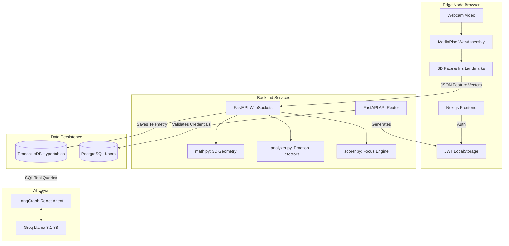

**🚀 Deployed Application on AWS:** [https://myfocusai.duckdns.org](https://myfocusai.duckdns.org)

<div align="center">

https://github.com/user-attachments/assets/054df42b-38f9-43c3-b025-74d967b0edc3
# 🧠 FocusAI: Cognitive Telemetry Engine

**An enterprise-grade Agentic AI platform for real-time extraction of human cognitive states.**

[](https://nextjs.org/)
[](https://fastapi.tiangolo.com/)
[](https://www.postgresql.org/)
[](https://webassembly.org/)
[](https://langchain-ai.github.io/langgraph/)

By deploying a highly optimized Edge AI vision pipeline directly in the browser, FocusAI transforms raw video into a continuous stream of lightweight, multi-modal biometric telemetry. This telemetry acts as the foundation for **Retrieval-Augmented Generation (RAG)**, allowing Autonomous Agents to analyze human engagement.

</div>

---

## 📖 Table of Contents
- [✨ Key Features](#-key-features)
- [🏗️ System Architecture](#-system-architecture)
- [🚀 Technical Deep Dive](#-technical-deep-dive)
- [🛠️ Tech Stack](#-tech-stack)
- [💻 Quick Start Guide](#-quick-start-guide)

---

## ✨ Key Features

| Feature | Description |
| :--- | :--- |
| **Edge AI Processing** | 100% of the Deep Learning Face Mesh processing runs on the client GPU/CPU via WebAssembly. Video never leaves the device. |
| **Micro-Expression Engine** | Geometric heuristics detect Yaw/Pitch/Roll, Eye Aspect Ratio (EAR) for blinking, and Mouth Aspect Ratio (MAR) for yawning. |
| **Dual-Database Architecture** | Uses PostgreSQL for secure JWT authentication, and TimescaleDB Hypertables for high-frequency time-series telemetry tracking. |
| **Agentic AI Layer** | Powered by Groq (Llama 3.1) and LangGraph, the AI acts autonomously to query databases and generate insights. |
| **Real-Time Dashboards** | A beautiful Next.js dashboard polling live metrics via REST APIs and WebSockets. |

---

## 🏗️ System Architecture

FocusAI operates over a distributed architecture combining on-device Edge computing with a modular, highly-concurrent Python backend.



---

## 🚀 Technical Deep Dive

* **Biometric Rule-Based Emotion Engine:** Instead of heavy server-side AI, the backend uses geometric heuristics (Mouth Aspect Ratio for yawning, Eyebrow Furrowing for tension) to deduce micro-expressions effortlessly at 30fps.
* **LangGraph Agentic Layer:** A ReAct agent powered by Groq's insanely fast `Llama 3.1` model sits on the Admin Dashboard. It has autonomous tool-access to query the TimescaleDB database directly to answer natural language questions about student engagement.

---

## 🛠️ Tech Stack

### 🎨 Frontend (Edge Node)
* **Framework:** Next.js 15, React, TypeScript
* **Styling:** TailwindCSS
* **AI:** WebAssembly (WASM), MediaPipe Tasks Vision

### ⚙️ Backend (Telemetry Server)
* **Core:** Python 3.13, FastAPI, Uvicorn, WebSocket
* **Logic:** NumPy, PyJWT
* **AI Agents:** LangChain, LangGraph, ChatGroq

### 💾 Data Persistence
* **Databases:** PostgreSQL, TimescaleDB
* **ORM:** SQLAlchemy, asyncpg

---

## 💻 Quick Start Guide

### Prerequisites
* Node.js (v18+)
* Python (v3.9+)
* Docker Desktop 

### 1. Initial Setup
Ensure your virtual environment is created and dependencies are installed:
```bash
# Backend
cd backend
python3 -m venv .venv
source .venv/bin/activate
pip install -r requirements.txt
cd ..

# Frontend
cd frontend
npm install
cd ..
```

### 2. Start All Services
We provide a convenient script to instantly boot up the databases (Docker), Backend, and Frontend.
```bash
chmod +x start.sh
./start.sh
```
*(This starts the Next.js portal on `localhost:3000` and FastAPI on `localhost:8000`)*

### 3. Test on Phone (Optional)
To expose your local environment over a secure internet tunnel for phone testing:
```bash
./start.sh --tunnel
```

### 4. Create an Admin User
```bash
cd backend
.venv/bin/python create_admin.py \
  --username "bits_pilani" \
  --password "admin123" \
  --name "BITS Pilani Admin" \
  --email "admin@bits-pilani.ac.in"
```

### Deployment
For production deployment, you can use the deployment script:
```bash
chmod +x deploy.sh
./deploy.sh
```
